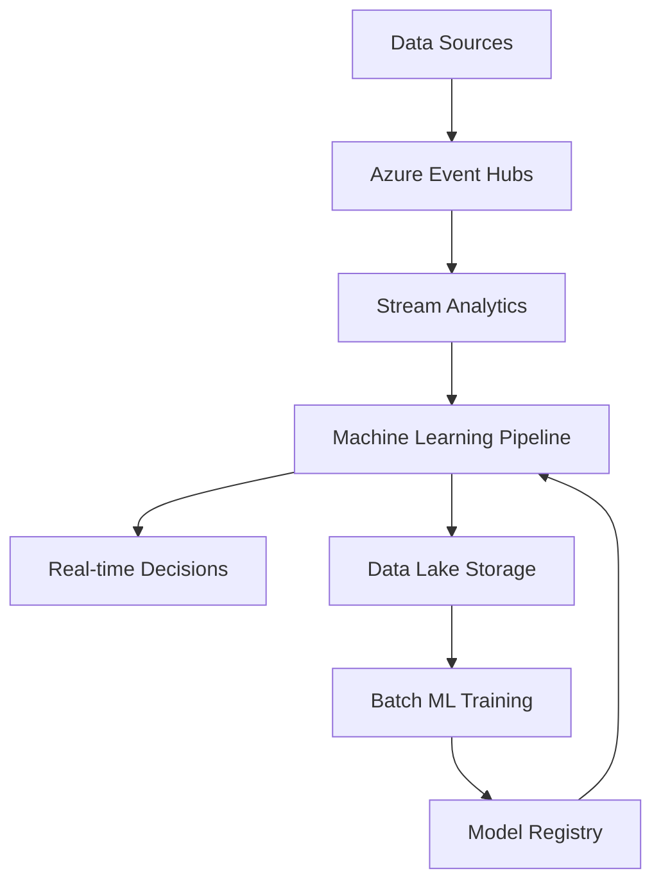

# Building Intelligent Cloud Solutions: Patterns and Practices

In today's rapidly evolving technology landscape, building "smart" cloud solutions isn't just a competitive advantage—it's becoming a necessity. After two decades of software development and specializing in AI-first Azure cloud architectures, I want to share the patterns and practices that truly make cloud solutions intelligent.

## What Makes a Cloud Solution "Intelligent"?

An intelligent cloud solution goes beyond traditional automation. It exhibits these characteristics:

- **Adaptive Behavior**: Learns from patterns and adjusts automatically
- **Predictive Capabilities**: Anticipates needs and problems before they occur
- **Contextual Decision Making**: Makes decisions based on comprehensive data analysis
- **Self-Healing**: Detects and resolves issues autonomously
- **Continuous Improvement**: Gets better over time through feedback loops

## Core Patterns for Intelligent Solutions

### 1. The Cognitive Gateway Pattern

This pattern places AI capabilities at the entry point of your system:

```csharp
public class CognitiveApiGateway
{
    private readonly ITextAnalyticsClient _textAnalytics;
    private readonly IAnomalyDetectorClient _anomalyDetector;
    
    public async Task<ProcessedRequest> ProcessIncomingRequest(ApiRequest request)
    {
        var analysis = new RequestAnalysis();
        
        // Sentiment analysis for customer requests
        if (request.ContainsText)
        {
            analysis.Sentiment = await _textAnalytics.AnalyzeSentimentAsync(request.Text);
        }
        
        // Anomaly detection for request patterns
        analysis.IsAnomalous = await _anomalyDetector.DetectAsync(
            new RequestPattern(request.UserId, request.Timestamp, request.RequestType)
        );
        
        // Route based on intelligence
        return new ProcessedRequest(request, analysis);
    }
}
```

### 2. The Intelligent Event Stream Pattern

Transform your event-driven architecture to include AI processing:

```csharp
public class IntelligentEventProcessor
{
    public async Task ProcessEvent(CloudEvent cloudEvent)
    {
        // Extract features from the event
        var features = await ExtractFeatures(cloudEvent);
        
        // Run through ML pipeline
        var prediction = await _mlModel.PredictAsync(features);
        
        // Generate intelligent responses
        var actions = await DetermineActions(prediction, cloudEvent);
        
        // Execute actions
        foreach (var action in actions)
        {
            await ExecuteAction(action);
        }
        
        // Feed back for learning
        await RecordOutcome(cloudEvent, actions);
    }
}
```

### 3. The Self-Healing Infrastructure Pattern

Build systems that can diagnose and fix themselves:

```csharp
public class SelfHealingService
{
    private readonly IHealthMonitor _healthMonitor;
    private readonly IRemediationEngine _remediation;
    
    public async Task MonitorAndHeal()
    {
        var healthMetrics = await _healthMonitor.GetCurrentMetrics();
        var issues = await AnalyzeHealth(healthMetrics);
        
        foreach (var issue in issues)
        {
            var remediation = await _remediation.GetRemediation(issue);
            
            if (remediation.ConfidenceScore > 0.8)
            {
                await ExecuteRemediation(remediation);
                await LogRemediation(issue, remediation);
            }
            else
            {
                await AlertHumans(issue);
            }
        }
    }
}
```

## Implementation Architecture

### Data Pipeline for Intelligence



### Azure Services for Intelligent Solutions

**Data Ingestion & Processing:**
- Azure Event Hubs for high-throughput event streaming
- Azure Stream Analytics for real-time processing
- Azure Data Factory for batch processing

**AI & ML Services:**
- Azure Machine Learning for custom models
- Cognitive Services for pre-built AI capabilities
- Azure Bot Service for conversational AI

**Decision & Action:**
- Azure Logic Apps for workflow automation
- Azure Functions for serverless execution
- Azure Service Bus for reliable messaging

## Real-World Example: Intelligent Transport System

Let me share a detailed example from my work at Tokiota, where we built an intelligent passenger transport optimization system:

### The Challenge
Goal Systems needed to optimize passenger transport routes in real-time while predicting maintenance needs and improving overall service quality.

### Intelligent Architecture

```csharp
public class TransportIntelligenceOrchestrator
{
    public async Task OptimizeTransportOperation()
    {
        // Collect real-time data
        var telemetry = await _iotHub.GetVehicleTelemetry();
        var passengerData = await _passengerService.GetCurrentDemand();
        var weatherData = await _weatherService.GetConditions();
        
        // AI-powered route optimization
        var routeOptimization = await _routeOptimizer.OptimizeRoutes(
            telemetry, passengerData, weatherData
        );
        
        // Predictive maintenance
        var maintenancePredicition = await _maintenancePredictor.PredictIssues(telemetry);
        
        // Dynamic scheduling
        var scheduleAdjustments = await _scheduler.AdjustSchedules(
            routeOptimization, maintenancePredicition
        );
        
        // Execute changes
        await _dispatcher.ImplementChanges(scheduleAdjustments);
        
        // Learn from outcomes
        await _feedbackProcessor.RecordOutcomes(scheduleAdjustments);
    }
}
```

### Intelligence Layers

**1. Perception Layer**
```csharp
public class VehiclePerceptionService
{
    public async Task<VehicleState> AnalyzeVehicleState(VehicleTelemetry telemetry)
    {
        return new VehicleState
        {
            HealthScore = await CalculateHealthScore(telemetry),
            PerformanceMetrics = await AnalyzePerformance(telemetry),
            PredictedIssues = await PredictIssues(telemetry),
            OptimalRoute = await CalculateOptimalRoute(telemetry.Location)
        };
    }
}
```

**2. Decision Layer**
```csharp
public class TransportDecisionEngine
{
    public async Task<TransportDecisions> MakeDecisions(
        IEnumerable<VehicleState> vehicleStates,
        PassengerDemand demand,
        WeatherConditions weather)
    {
        var decisions = new TransportDecisions();
        
        // Route optimization using ML
        decisions.RouteChanges = await _routeML.OptimizeRoutes(vehicleStates, demand);
        
        // Maintenance scheduling
        decisions.MaintenanceSchedule = await _maintenanceML.ScheduleMaintenance(vehicleStates);
        
        // Capacity adjustments
        decisions.CapacityAdjustments = await _capacityML.AdjustCapacity(demand, weather);
        
        return decisions;
    }
}
```

**3. Action Layer**
```csharp
public class TransportActionExecutor
{
    public async Task ExecuteDecisions(TransportDecisions decisions)
    {
        // Update vehicle routes
        foreach (var routeChange in decisions.RouteChanges)
        {
            await _vehicleService.UpdateRoute(routeChange.VehicleId, routeChange.NewRoute);
        }
        
        // Schedule maintenance
        foreach (var maintenance in decisions.MaintenanceSchedule)
        {
            await _maintenanceService.ScheduleMaintenance(maintenance);
        }
        
        // Adjust capacity
        foreach (var adjustment in decisions.CapacityAdjustments)
        {
            await _capacityService.AdjustCapacity(adjustment);
        }
    }
}
```

### Results
- **25% reduction** in route optimization time
- **40% improvement** in predictive maintenance accuracy
- **30% increase** in passenger satisfaction scores
- **20% reduction** in operational costs

## Best Practices for Intelligent Solutions

### 1. Start with Clear Intelligence Goals
```csharp
public class IntelligenceGoals
{
    public string BusinessObjective { get; set; } // e.g., "Reduce customer churn by 15%"
    public List<string> SuccessMetrics { get; set; } // e.g., ["Churn rate", "Customer satisfaction"]
    public TimeSpan EvaluationPeriod { get; set; } // e.g., 3 months
}
```

### 2. Implement Feedback Loops
```csharp
public class IntelligenceFeedbackLoop
{
    public async Task RecordDecisionOutcome(
        Guid decisionId, 
        object decision, 
        object outcome)
    {
        var feedback = new DecisionFeedback
        {
            DecisionId = decisionId,
            Decision = JsonSerializer.Serialize(decision),
            Outcome = JsonSerializer.Serialize(outcome),
            Timestamp = DateTime.UtcNow
        };
        
        await _feedbackRepository.Store(feedback);
        
        // Trigger model retraining if enough new data
        if (await ShouldRetrain())
        {
            await _mlPipeline.TriggerRetraining();
        }
    }
}
```

### 3. Design for Explainability
```csharp
public class ExplainableDecision
{
    public object Decision { get; set; }
    public double ConfidenceScore { get; set; }
    public List<FeatureImportance> ImportantFeatures { get; set; }
    public string Explanation { get; set; }
    public List<string> AlternativeOptions { get; set; }
}
```

### 4. Implement Gradual Rollout
```csharp
public class IntelligentFeatureToggle
{
    public async Task<bool> ShouldUseIntelligentPath(string userId, string feature)
    {
        var userRolloutPercentage = await GetRolloutPercentage(feature);
        var userHash = ComputeHash(userId + feature);
        
        return (userHash % 100) < userRolloutPercentage;
    }
}
```

## Monitoring Intelligent Solutions

### Intelligence-Specific Metrics
```csharp
public class IntelligenceMetrics
{
    public double ModelAccuracy { get; set; }
    public double PredictionConfidence { get; set; }
    public TimeSpan DecisionLatency { get; set; }
    public int AutomatedDecisions { get; set; }
    public int HumanInterventions { get; set; }
    public double BusinessImpactScore { get; set; }
}
```

### Continuous Monitoring
```csharp
public class IntelligenceMonitor
{
    public async Task MonitorIntelligence()
    {
        var metrics = await GatherIntelligenceMetrics();
        
        // Check for model drift
        if (metrics.ModelAccuracy < _thresholds.MinAccuracy)
        {
            await TriggerModelRetraining();
        }
        
        // Check for bias
        var biasMetrics = await AnalyzeBias(metrics);
        if (biasMetrics.HasSignificantBias)
        {
            await AlertForBias(biasMetrics);
        }
        
        // Performance monitoring
        if (metrics.DecisionLatency > _thresholds.MaxLatency)
        {
            await OptimizePerformance();
        }
    }
}
```

## Conclusion

Building intelligent cloud solutions requires a fundamental shift in how we architect systems. Key principles to remember:

1. **Intelligence is a journey, not a destination** - Start simple and evolve
2. **Data quality determines intelligence quality** - Invest in good data pipelines
3. **Feedback loops are essential** - Systems must learn from their decisions
4. **Explainability matters** - Users need to understand and trust AI decisions
5. **Monitor constantly** - Intelligence can drift and degrade over time

The future belongs to systems that can think, learn, and adapt. By implementing these patterns and practices, you can build cloud solutions that don't just respond to change—they anticipate and prepare for it.

---

*Ready to make your cloud solutions more intelligent? I'd love to help you design and implement AI-first architectures. [Connect with me on LinkedIn](https://www.linkedin.com/in/javiervillullas/) or [send me an email](mailto:jvillullas@gmail.com) to discuss your specific challenges.*
